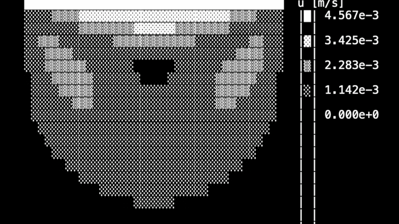

# ns2d
A simple conditionaly stable 2D incompressible Navier-Stokes solver on a regular Cartesian quadrilateral grid, utilizing the Chorin projection/decomposition method.

## How to solve the incompressible Navier-Stokes equations

The governing equations are:

$$
\frac{\partial \vec{u}}{\partial t} = -(\vec{u} \cdot \nabla) \vec{u} - \frac{1}{\rho} \nabla p + \nu \nabla^2 \vec{u}
$$

$$
\nabla \cdot \vec{u} = 0
$$

We use the splitting method based on the Helmholtz-Hodge decomposition. For any arbitrary vector field $\vec{w}$, we decompose it as:

$$
\vec{w} = \vec{u} + \nabla \phi
$$

with:

$$
\nabla \cdot \vec{u} = 0, \quad \nabla \times \vec{u} \neq 0
$$

$$
\nabla \cdot (\nabla \phi) \neq 0, \quad \nabla \times (\nabla \phi) = 0
$$

Thus, the velocity field becomes:

$$
\vec{w} = \vec{u} + \frac{\Delta t}{\rho} \nabla p
$$

## Steps of time-explicit method:

### 1. Diffusion step: 

$$
\frac{\partial \vec{u}}{\partial t} = \nu \nabla^2 \vec{u}
$$

Finite Difference (FD) form: 

$$
\vec{u} - \vec{u}_{\text{prev}} = \Delta t \cdot \nu \nabla^2 \vec{u}_{prev}
$$

### 2. Advection step: 

$$
\frac{\partial \vec{u}}{\partial t} = - (\vec{u} \cdot \nabla) \vec{u}
$$

FD form: 

$$
\vec{u} - \vec{u}_{prev} = \Delta t \cdot \left( - (\vec{u} \cdot \nabla) \vec{u} \right)
$$

### 3. Poisson equation: 

$$
\nabla^2 p = \frac{\rho}{\Delta t} \nabla \cdot \vec{w}
$$

FD form:

$$
-4p(i_y,i_x) + p(i_y+1,i_x) + p(i_y-1,i_x) + p(i_y,i_x+1) + p(i_y,i_x-1) = h^2 \cdot \frac{\rho}{\Delta t} \nabla \cdot \vec{u} = S
$$

Rewritten expression for iteartive Gauss-Sedel solver:

$$
p(i_y,i_x) = \frac{1}{4} \left( p(i_y+1,i_x) + p(i_y-1,i_x) + p(i_y,i_x+1) + p(i_y,i_x-1) - S \right)
$$

### 4. Apply pressure: 

$$
\vec{u} = \vec{u}_{prev} - \Delta t \cdot \frac{1}{\rho} \nabla p
$$

## Demo

A test case involves lid-driven flow in a box cavity. All walls have zero Dirichlet velocity conditions, except for the top side, where a sliding velocity is defined. This velocity periodically changes its direction from left to right and vice versa. The magnitude of the velocity field is represented using ASCII art.

