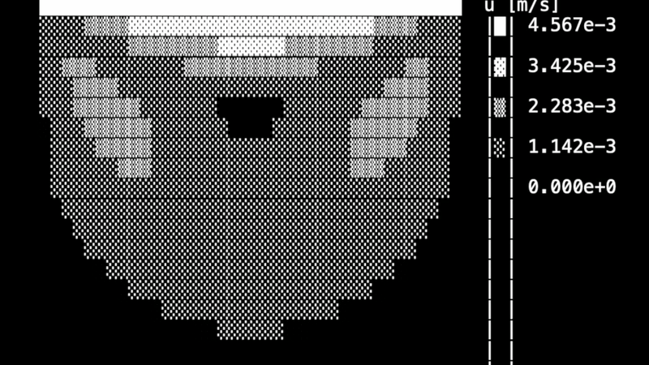

# ns2d
A simple conditionally stable 2D incompressible Navier-Stokes solver on a regular Cartesian quadrilateral grid, utilizing the Chorin projection/decomposition method.

The repository contains two implementations:
- [`JavaScript`](./js/) version with browser-based solver.
- [`C++ console`](./cpp/) version with MSVC project files, including enhanced ASCII rendering.

In the C++ renderer, each grid cell can display not only velocity magnitude, but also normalized velocity-vector direction markers.

## How to solve the incompressible Navier-Stokes equations

The governing equations are:

$$
\frac{\partial \vec{u}}{\partial t} = -(\vec{u} \cdot \nabla) \vec{u} - \frac{1}{\rho} \nabla p + \nu \nabla^2 \vec{u}
$$

$$
\nabla \cdot \vec{u} = 0
$$

We use the splitting method based on the Helmholtz-Hodge decomposition. For any arbitrary vector field $\vec{w}$, we decompose it as:

$$
\vec{w} = \vec{u} + \nabla \phi
$$

with:

$$
\nabla \cdot \vec{u} = 0, \quad \nabla \times \vec{u} \neq 0
$$

$$
\nabla \cdot (\nabla \phi) \neq 0, \quad \nabla \times (\nabla \phi) = 0
$$

Thus, the velocity field becomes:

$$
\vec{w} = \vec{u} + \frac{\tau}{\rho} \nabla p
$$

## Steps of the time-explicit method:

### 1. Velocity diffusion step:

$$
\frac{\partial \vec{u}}{\partial t} = \nu \nabla^2 \vec{u}
$$

Finite Difference (FD) form:

$$
\vec{u} - \vec{u}_{\text{prev}} = \tau \cdot \nu \nabla^2 \vec{u}_{prev}
$$

### 2. Velocity self-advection step:

$$
\frac{\partial \vec{u}}{\partial t} = - (\vec{u} \cdot \nabla) \vec{u}
$$

FD form:

$$
\vec{u} - \vec{u}_{prev} = \tau \cdot \left( - (\vec{u} \cdot \nabla) \vec{u} \right)
$$

### 3. Poisson equation:

$$
\nabla^2 p = \frac{\rho}{\tau} (\nabla \cdot \vec{u})
$$

FD form:

$$
-4p[i_y,i_x] + p[i_y+1,i_x] + p[i_y-1,i_x] + p[i_y,i_x+1] + p[i_y,i_x-1] = h^2 \frac{\rho}{\tau} \nabla \cdot \vec{u} = S
$$

Rewritten expression for the iterative Gauss-Seidel solver:

$$
p[i_y,i_x] = \frac{1}{4} \left( p[i_y+1,i_x] + p[i_y-1,i_x] + p[i_y,i_x+1] + p[i_y,i_x-1] - S \right)
$$

### 4. Apply pressure to correct velocity:

$$
\vec{u} = \vec{u}_{prev} - \tau \frac{1}{\rho} \nabla p
$$

## Demo

A test case involves lid-driven flow in a box cavity. All walls have zero Dirichlet velocity conditions, except for the top side, where a sliding velocity is defined. This velocity periodically changes its direction from left to right and vice versa.

The JavaScript solution visualizes velocity magnitude using ASCII art.

The C++ solution (MSVC project) additionally visualizes normalized velocity-vector directions for each cell. The built executable is available in the [`cpp/ns_2d_console/build/`](./cpp/ns_2d_console/build/) directory.

## Run

- JavaScript version: open [`js/index.html`](./js/index.html) in a web browser.
- Windows compiled C++ version: run the executable from [`cpp/ns_2d_console/build/Release/`](./cpp/ns_2d_console/build/Release/) (compiled for ARM64 architecture).
- Manual compilation: requires Microsoft Visual Studio (MSVC toolchain) using the project file [`cpp/ns_2d_console/ns_2d_console.slnx`](./cpp/ns_2d_console/ns_2d_console.slnx).
